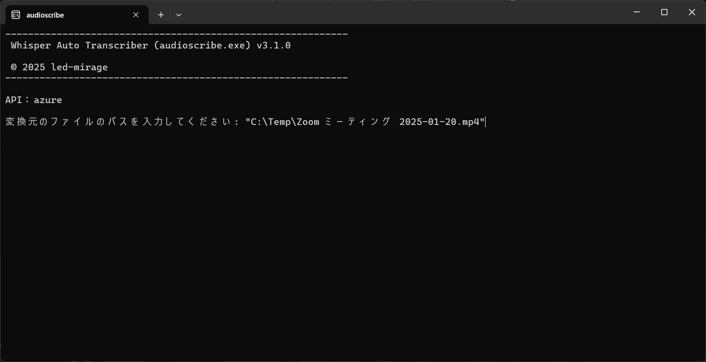

#  Whisper Auto Transcriber

Copyright (c) 2025 led-mirage

## 💎 概要

**Whisper Auto Transcriber**は、音声または動画ファイルの音声をテキスト化する便利なツールです。OpenAIもしくはAzure OpenAI ServiceのWhisperモデル（API）を使用して高精度の音声認識を行い、結果をテキストファイルとして出力します。

会議の録音など長時間の音声データをテキストとして保存したいときに便利です。このツールで音声をテキスト化した後で、出力されたテキストをAIに要約してもらうことで、簡単に議事録などを作成できます。

NVIDIAのGPUをお持ちの方は、すべての処理をローカルPCで完結できる [Whisper Local Transcriber](https://github.com/led-mirage/whisper-local-transcriber) の利用もご検討ください。こちらを使うことでOpenAI APIの利用登録、利用料金が不要になります。

## 💎 主な機能

- **マルチクラウド対応**: OpenAI と Azure OpenAI Service に対応しています。
- **多様なファイル形式**: mp3, m4a, mp4, avi, mov, mkvなど一般的な音声・動画形式に対応しています。
- **動画ファイル対応**: 動画ファイルの場合は、自動的に音声データに変換し処理するため、追加作業は不要です。
- **音声の自動分割処理**: Whisper APIの制限に対応するため、音声ファイルを5分ごとに自動分割し処理するため、手動での分割作業が不要です。
- **音声認識**: Whisper APIを使用し、音声データをテキストに変換します。
- **整理された出力**: 変換されたテキストは1つのファイルに統合され、`output`ディレクトリに保存します。

## 💎 スクリーンショット



<div class="page"/>

## 💎 事前準備

### APIキーの取得

- OpenAIのAPIキー
    - [OpenAI Platform](https://platform.openai.com/)に登録し、APIキーを発行してください。

- または、Azure OpenAI Serviceの設定
    - Azure OpenAI Serviceを利用する場合は、APIキーとエンドポイントを取得してください。くわえて、**Whisperモデル**をAzure上でデプロイして使用できる状態にしてください。
    - 2025年3月現在、日本リージョンではWhisperモデルをデプロイできないようです。動作確認にはnorthcentralusリージョンを使いました。
    - デプロイ可能なリージョンは[Microsoftのサイト](https://learn.microsoft.com/ja-jp/azure/ai-services/openai/concepts/models?tabs=global-standard%2Cstandard-audio#audio-models)でご確認ください。

### ソフトウェア要件

[Releases](https://github.com/led-mirage/whisper-auto-transcriber/releases)に登録されているZIPの中にあるWindows用実行ファイル（audioscribe.exe）を使う場合は下記ソフトウェアを別途準備する必要はありません。FFmpegはZIPファイル中に同梱されており、このプログラムでは自動的にそれを使用するように設定されています。Pythonも実行ファイル中に組み込まれているため不要です。

- Python
    - Python 3.8 以上が必要です。仮想環境（venv）の利用を推奨します。
    - Python 3.12.0 で動作確認済みです。

- FFmpeg
    - [FFmpegのサイト](https://www.ffmpeg.org/)からダウンロードし、パスを通してください。
    - FFmpeg version n7.1で動作確認済みです。

<div class="page"/>

## 💎 インストール

### 📌 実行ファイル（audioscribe.exe）を使う場合

1. このツールを配置するディレクトリを作成します。
2. [Releases](https://github.com/led-mirage/whisper-auto-transcriber/releases)ページからZIPファイルをダウンロードして、作成したディレクトリに解凍します。

### 📌 Pythonで実行する場合

1. プロジェクト用ディレクトリを作成し、移動します。
2. GitHubからソースを取得します：
    ```
    git clone https://github.com/led-mirage/whisper-auto-transcriber.git
    ```
3. 仮想環境を作成し、アクティベートします（推奨）：
    ```
    python -m venv venv
    venv\Scripts\activate   # macOS/Linuxの場合は source venv/bin/activate
    ```
4. 必要なライブラリの取得します：
    ```
    pip install -r requirements.txt
    ```

## 💎 設定

OSの環境変数の設定と、必要に応じて設定ファイル（settings.ini）の設定が必要です。

### 📌 OpenAIを使用する場合

- OSの環境変数`OPENAI_API_KEY`にAPIキーを設定してください。
    - settings.iniファイルの`api_key`に直接記載することも可能です。
- settings.iniファイルのAPI typeを`openai`にします（デフォルト）。

### 📌 Azure OpenAI Serviceを使用する場合

- OSの環境変数`AZURE_OPENAI_API_KEY`にAPIキーを設定してください。
    - settings.iniファイルの`api_key`に直接記載することも可能です。
- OSの環境変数`AZURE_OPENAI_ENDPOINT`にエンドポイントを設定してください。
    - settings.iniファイルの`endpoint`に直接記載することも可能です。
- settings.iniファイルのAPI typeを`azure`にします。
- 必要に応じて、モデル、APIキー、エンドポイントの設定を行ってください。
- settings.iniファイルではその他詳細な設定が可能です。詳しくは以下の`設定ファイル（settings.ini）`の項目を参照してください。

## 💎 実行方法

### 📌 実行ファイル（audioscribe.exe）を使う場合

1. 実行ファイル（audioscribe.exe）をダブルクリックして起動します：
2. テキスト化する音声または動画ファイルのパスを入力してEnterキーを押します：
    ```
    変換元のファイルのパスを入力してください: c:\temp\test.mp3
    ```
3. 出力：  
    結果は`output`ディレクトリ内にテキストファイルとして出力されます。  
    ファイル名は`[元のファイル名（拡張子を除く）].txt`になります。

### 📌 Pythonで実行する場合

1. 起動します：
    ```
    python src/main.py
    ```
2. テキスト化する音声または動画ファイルのパスを入力してEnterキーを押します：
    ```
    変換元のファイルのパスを入力してください: c:\temp\test.mp3
    ```
3. 出力：  
    結果は`output`ディレクトリ内にテキストファイルとして出力されます。  
    ファイル名は`[元のファイル名（拡張子を除く）].txt`になります。

<div class="page"/>

## 💎 設定ファイル (`settings.ini`)

アプリケーションを実行する前に、`settings.ini`ファイルを正しく設定してください。このファイルでは、APIタイプやモデル名、APIキーの設定を行います。

### APIセクション

- **type**: 使用するAPIの種類を指定します。`openai` もしくは `azure` を設定してください。デフォルトは`openai`です。

### OpenAIセクション

- **model_name**: 使用するOpenAIモデルを指定します。デフォルトは `whisper-1` です。
- **api_key**: OpenAIのAPIキーを直接指定する場合に使用します。環境変数を使用する場合は空にしてください。
- **api_key_env**: APIキーを指定する際の環境変数名を入力してください。デフォルトは `OPENAI_API_KEY` ですが、ユーザーが自由に環境変数名を設定できます。

### Azureセクション

- **model_name**: 使用するAzureモデルを指定します。デフォルトは `whisper` です。
- **api_key**: AzureのAPIキーを直接指定する場合に使用します。環境変数を使用する場合は空にしてください。
- **endpoint**: エンドポイントを直接指定する場合に使用します。環境変数を使用する場合は空にしてください。
- **api_key_env**: APIキーを指定する際の環境変数名を入力してください。デフォルトは `AZURE_OPENAI_API_KEY` ですが、ユーザーが自由に設定できます。
- **endpoint_env**: エンドポイントを指定する際の環境変数名を入力してください。デフォルトは `AZURE_OPENAI_ENDPOINT` ですが、ユーザーが自由に設定できます。

### Generalセクション

- **audio_segment_time**: 音声を分割する単位を秒単位で指定します。デフォルトは300秒です。

<div class="page"/>

## 💎 Whisper APIの利用料金

Whisperの利用料金は、変換元の音声の長さに基づいており、１分あたり`$0.006`※です。例えば１時間の音声または動画ファイルをテキスト化すると、$0.36かかります。

※価格の詳細は以下のサイトで確認してください。

- [OpenAIの価格ページ](https://openai.com/ja-JP/api/pricing/)
- [Azure OpenAI Serviceの価格ページ](https://azure.microsoft.com/ja-jp/pricing/details/cognitive-services/openai-service/#pricing)


## 💎 注意事項

### ウィルス対策ソフトの誤認問題

このプログラムの実行ファイル（audioscribe.exe）はウィルス対策ソフトにマルウェアと誤認されることがあります。

もちろん、このアプリに悪意のあるプログラムは入っていませんが、気になる人は上記の「Pythonで実行する場合」で実行してください。

誤認問題が解決できるのが一番いいのですが、いい方法が見つかっていないので申し訳ありませんがご了承ください。

VirusTotalでのチェック結果は[ここ](https://www.virustotal.com/gui/file/0ad75ab746c967279cefee665753353e8fc2b7655ef3324354f7c5e597050c33?nocache=1)で確認できます（2025/03/20 v3.1.1）

73個中2個のアンチウィルスエンジンで検出

## 💎 使用しているライブラリ

### 🔖 openai 1.67.0
ホームページ： <https://github.com/openai/openai-python>  
ライセンス： Apache License 2.0

### 🔖 FFmpeg v7.1
ホームページ： <https://ffmpeg.org/>  
ライセンス： GNU Lesser General Public License (LGPL) v2.1

## 💎 ライセンス

© 2025 led-mirage

本アプリケーションは MITライセンス の下で公開されています。詳細については、プロジェクトに含まれる LICENSE ファイルを参照してください。

<div class="page"/>

## 💎 バージョン履歴

### 3.1.1 (2025/03/20)

- 実行ファイルにメタデータを埋め込むようにしました。
- openaiパッケージを1.67.0に更新しました。
- 機能の変更はありません。

### 3.1.0 (2025/03/14)

- 処理終了時に出力フォルダをデフォルトファイルマネージャで開くようにしました。

### 3.0.0 (2025/03/10)

- Windows用実行ファイル（audioscribe.exe）を追加しました。
- Release ZIPにFFmpegを同梱しました。

### 2.0.0 (2025/02/27)

- HotFix: 動画を指定した場合、テキスト化が途中で停止する問題を修正しました。
- Azure OpenAI Serviceに対応しました。
- 設定を`settings.ini`ファイルに移動しました。

### 1.0.0 (2025/02/26)

- ファーストリリース
