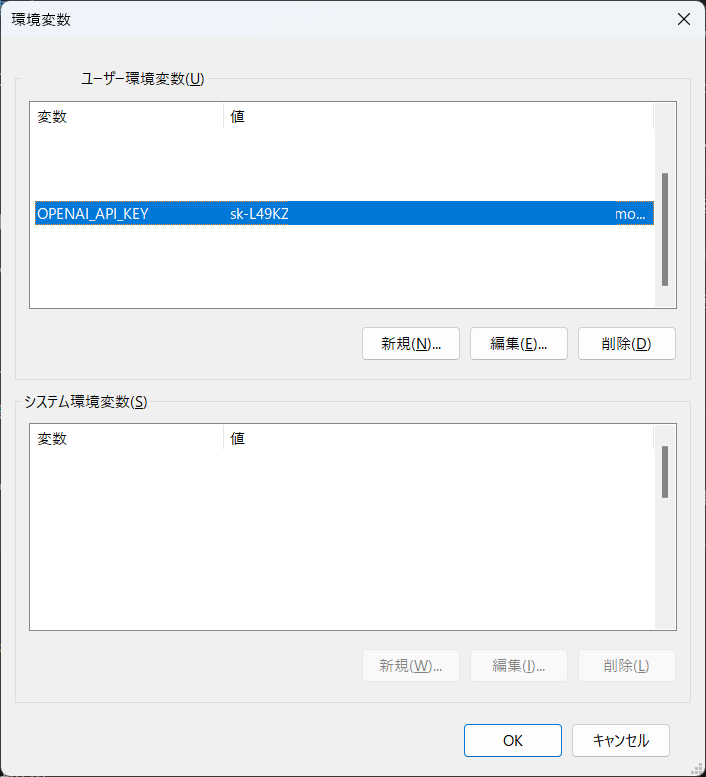

#  クイックスタートガイド

Copyright (c) 2025 led-mirage

## 概要

**Whisper Auto Transcriber**は、音声または動画ファイルの音声をテキスト化する便利なツールです。

この資料ではこのソフトウェアの使用手順を説明します。想定する環境は以下の通りです。

- Windows 10 / 11
- OpenAI Whisper APIを使用

## 1. OpenAI APIキーの取得

[OpenAI Platform](https://platform.openai.com/)にアクセスし、APIキーを取得します。

詳細はネット上の情報を参考にしてください。[このあたり](https://note.com/yon4987/n/n5d2f0bd3356c)の情報が参考になると思います。

Whisper APIを使うには事前にクレジットをチャージしておく必要があります。

※3時間の音声データをテキスト化するには約１ドル程度必要です（2025年3月現在）。

## 2. 環境変数にAPIキーを登録

取得したAPIキーを、ユーザー環境変数「OPENAI_API_KEY」を作成し登録します。

環境変数の編集ウィンドウは、Windowsの検索窓で「環境変数」を検索すれば見つかります。

「新規」ボタンをクリックし、変数名に「OPENAI_API_KEY」を、変数値に取得したAPIキーを入力しOKします。

## 3. 実行

「audioscribe.exe」をダブルクリックして実行します。

変換元のファイルのパスを入力します。

エクスプローラーで対象のファイルを右クリックして「パスのコピー」を選択し、それを貼り付けると簡単です。

変換が終わると、「output」フォルダに変換結果のテキストファイルが保存されます。
